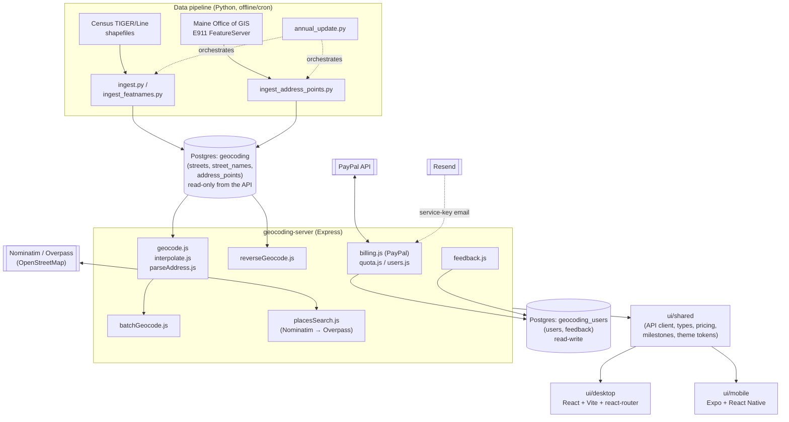

# Architecture

> Reverse-engineered from the current codebase (August 2026) as a
> reference document — it describes the system as it exists, not a
> proposal. See [DATA_MODEL.md](DATA_MODEL.md) for the database schema,
> [DESIGN_SYSTEM.md](DESIGN_SYSTEM.md) for the UI system, and
> [PROJECT_PLAN.md](PROJECT_PLAN.md) for how it got built in this order.

## One paragraph

Meridian is a purpose-built address-geocoding service for Maine and New
Hampshire: a Python ingest pipeline loads US Census TIGER/Line street
geometry (and, for Maine, real E911 address points) into PostGIS; a
Node/Express API resolves free-text addresses to coordinates against
that data, either by matching a real surveyed point or by interpolating
along a street segment's address range; and two client apps (a React
web app, an Expo/React Native mobile app) share one API client and a
common design system to expose that as single-lookup, reverse-geocode,
batch, and address-import workflows, with self-serve PayPal billing for
batch volume beyond a free tier.

## System diagram

## Components

| Component | Stack | Responsibility |
| --- | --- | --- |
| `geocoding/` | Python 3, psycopg | Ingests TIGER/Line + Maine E911 data into Postgres/PostGIS; the same interpolation math also lives here (`interpolate.py`) as a second implementation kept in sync by hand with the JS one, for the Python-side test/reference path. |
| `geocoding-server/` | Node.js, Express, `pg` | The public API. Owns both database pools, request validation, quota/auth, billing, email delivery, and the two upstream integrations (Nominatim/Overpass for place search). |
| `ui/shared/` | TypeScript | API client, response types, coordinate parsing, pricing data, the public progress timeline, and design tokens — imported directly by both frontend apps rather than duplicated. Deliberately excludes anything with `maplibre-gl` types, since each app's own install of that library is a nominally distinct type to TypeScript. |
| `ui/desktop/` | React 19, Vite, react-router 8 | Web app. Every screen the API exposes, plus Pricing/Checkout (PayPal Buttons SDK) and a Help page with annotated match diagrams. |
| `ui/mobile/` | Expo 57, React Native 0.86 | Same feature set as desktop, native-first: no router (a hand-rolled tab switcher in `App.tsx`), no interactive map on native (`GeocodeMap.tsx` is a deep-link "Open in Maps" button; the web build gets a real MapLibre map), SheetJS reads picked files as base64 instead of `arrayBuffer()`. |
| `ops/` | systemd units, shell scripts | Runs the server as a service (auto-restart, journald logging), and schedules the annual data-refresh and database-backup jobs. |

## Databases

Two logically and physically separate Postgres databases, deliberately not one:

- **`geocoding`** — `streets`, `street_names`, `address_points`. Populated
  entirely by the Python ingest pipeline; the Express API's pool against
  it is enforced **read-only at the Postgres session level**
  (`default_transaction_read_only`, see `createReadOnlyPool` in `db.js`,
  guarded by a dedicated test), so a bug in request-handling code
  can't corrupt reference data.
- **`geocoding_users`** — `users`, `feedback`. Real customer accounts,
  quota usage, service keys, and support messages. Read-write, and the
  only database anything backs up as sensitive (see
  `ops/backup-databases.sh`).

## Request flow: forward geocoding

1. `parseAddress.js` regex-parses free text into
   `{ number, streetName, zip, state, town }`. A missing house number or
   ZIP is rejected before any query runs.
2. **Exact match first** (Maine only): `matchAddressPoint()` looks for a
   real E911 point at that house number + street name (+ town, when
   given). A caller-supplied ZIP is cross-checked against `street_names`'
   ZIPs for that street *only when TIGER has data on that street at
   all* — silence isn't treated as confirmation, but a real contradiction
   is. State, when 2-letter, is checked directly against the point's own
   `state_abbr`.
3. **Range interpolation fallback**: house-number parity picks the left
   or right address range (odd → left, even → right) and the matching
   ZIP column (`zipl`/`zipr`); every `streets` segment for that
   street name + ZIP (+ state) is checked for one whose range contains
   the number; the point is interpolated proportionally along that
   segment's geometry and offset a configurable distance off the
   centerline onto the correct side.
4. Every response reports `source: "address_point" | "interpolation"`,
   so accuracy is never just assumed by the caller.

Reverse geocoding (`reverseGeocode.js`) runs conceptually backwards:
nearest segment by bounding box, which side of it the point falls on,
then a house number interpolated from how far along the segment the
point sits, rounded to the correct parity.

Batch geocoding (`batchGeocode.js`) runs the same per-address logic
sequentially over every line of an uploaded file — not
`Promise.all`'d, on purpose, to avoid exhausting the Postgres pool on a
large batch (bounded concurrency is planned, not yet built — see
[PROJECT_PLAN.md](PROJECT_PLAN.md)).

## Auth, quota, and billing

There's no signup/login/session system. An account is a row in `users`
(email, tier, usage, an opaque `service_key`). `/billing/purchase`
captures a one-time PayPal order server-side, verifies the captured
amount matches the tier's real price, adds the tier's address count to
the account's quota, generates a `service_key` if the account is new,
and emails it via SES (stubbed when SES env vars are unset). Every batch
endpoint requires **both** the email and its matching service key —
knowing an account's email alone is deliberately not enough to spend its
quota. A `GET /quota` read-only lookup takes just the email, since it
can't spend anything.

## Place search

`POST /places/search` tries Nominatim first (fast, reliable, but a
literal text index — it won't match a colloquial category term that only
exists as an OSM tag value), then falls back to Overpass (broader
regex-based tag matching, much less reliable/rate-limited) only when
Nominatim returns nothing or fails outright. This ordering itself was a
deliberate architectural change from an Overpass-only first version —
see [PROJECT_PLAN.md](PROJECT_PLAN.md) Phase 6.

## Deployment

Local dev runs `node src/server.js` directly. Anything beyond local dev
runs via `ops/geocoding-server.service` (systemd — restarts on crash or
reboot, captures every log line through journald). Two more scheduled
jobs run independently of the API process: `ops/geocoding-annual-update`
(refreshes TIGER + Maine E911 data once a year, insert-only/idempotent
so it's safe to run unattended) and a database-backup timer
(`ops/backup-databases.sh`, `pg_dump`s both databases, prunes anything
older than 14 days).

## Notable architectural decisions

- **Custom interpolation math instead of PostGIS `ST_LineInterpolatePoint`.**
  `geom` (native PostGIS geometry) exists on `streets` purely so the
  table opens as a real spatial layer in QGIS — the actual matching path
  parses the same data's plain WKT text column by hand in JS/Python.
  This is a real duplication (the same distance-along-a-line logic
  exists twice, in two languages, kept in sync manually) traded for not
  depending on a database round-trip's exact floating-point/projection
  behavior matching between the two ingest-time and query-time code
  paths.
- **`street_names` denormalizes `zipl`/`zipr`/`state`/`state_abbr` from
  `streets`** rather than joining at query time — measured ~15x slower
  at batch scale to join per-row than to filter one already-indexed
  table directly.
- **Two Postgres databases, not one**, so the reference geocoding data
  (rebuilt from public sources, replaceable) and real customer data
  (irreplaceable) have entirely separate connection pools, permissions,
  and backup treatment — a bug that can query one can't accidentally
  touch the other.
- **A monorepo with a `ui/shared` package**, not two independent
  frontend repos, so the API client, response types, and even the
  public-facing progress timeline can't drift between the two apps by
  construction.
